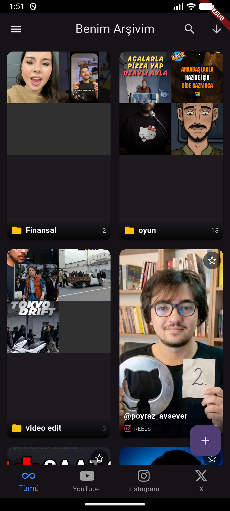
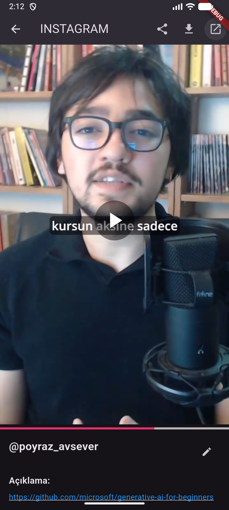
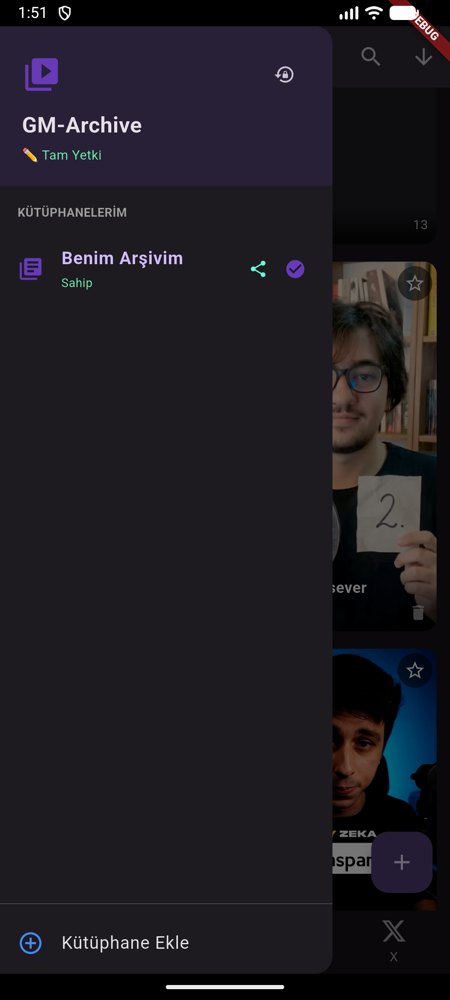
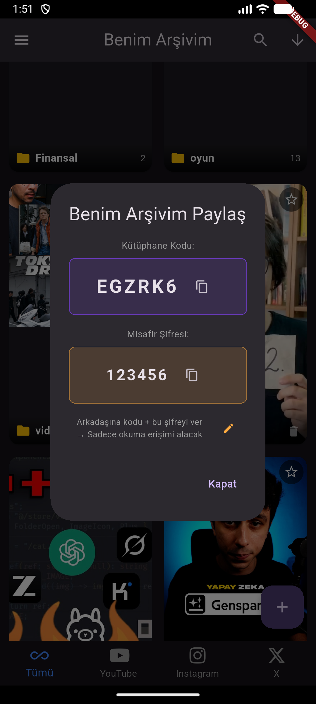

# GM-Archive

A Flutter-based social media bookmarking app that lets you save, organize, and watch videos from **YouTube**, **Instagram**, and **X (Twitter)** — all in one place.

Built with Firebase Firestore for real-time sync across devices, with a multi-library system for sharing collections.

## Features

- 🎬 **Multi-Platform Support** — Save videos from YouTube, Instagram Reels, and X/Twitter posts
- 📚 **Multi-Library System** — Create separate libraries with unique 6-character share codes
- 🔐 **Dual-Password Access** — Owner (full access) and Guest (read-only) modes
- 📂 **Folder Organization** — Group bookmarks into custom folders with drag-and-drop
- 🔍 **Search & Filter** — Filter by platform, search by title
- 📥 **Video Download** — Download with quality selection (360p, 720p, etc.)
- ⭐ **Favorites** — Star important bookmarks for quick access
- 🔄 **Real-time Sync** — Firestore streams for instant updates across devices

## Screenshots

<p align="center">
  
  
  
  
</p>


## Architecture

```
lib/
├── config/
│   └── api_keys.dart          # API keys (gitignored)
├── models/
│   ├── bookmark.dart          # Bookmark model with platform enum
│   ├── folder.dart            # Folder model
│   └── library.dart           # Library model with access levels
├── services/
│   ├── db_service.dart        # Firestore CRUD, library-scoped paths
│   ├── library_service.dart   # Library management, auth, local storage
│   ├── link_parser.dart       # URL parser for YT/IG/X
│   ├── metadata_service.dart  # Metadata fetcher with API routing
│   ├── instagram_api_service.dart  # Dual-API fallback for Instagram
│   ├── twitter_api_service.dart    # FxTwitter API integration
│   └── migration_service.dart      # Legacy data migration
├── screens/
│   ├── home_screen.dart       # Main grid view with drawer
│   ├── player_screen.dart     # Video player (YT/IG/X)
│   ├── folder_screen.dart     # Folder detail view
│   └── setup_screen.dart      # First-launch library setup
└── widgets/
    └── add_bookmark_dialog.dart  # URL input + metadata fetch
```

### Firestore Structure

```
libraries/{libraryId}
  ├── code, name, ownerPasswordHash, guestPasswordHash
  ├── bookmarks/{bookmarkId}
  │     ├── originalUrl, platform, videoId, title, thumbnailUrl
  │     └── videoDirectUrl, isStarred, addedAt, folderId
  └── folders/{folderId}
        ├── name, bookmarkIds[], thumbnailUrl
        └── createdAt
```

### Key Design Decisions

| Decision | Rationale |
|---|---|
| Subcollection-scoped paths | Each library is fully isolated in Firestore |
| SHA-256 password hashing | Secure auth without user accounts |
| Dual-API fallback (Instagram) | Handles rate limits by trying a secondary provider |
| `SharedPreferences` for library state | Fast local access without extra Firestore reads |
| `youtube_explode_dart` for downloads | Direct stream access without external dependencies |

## Setup

1. **Clone the repo**
   ```bash
   git clone https://github.com/Tunahanekemen/GM-Archive.git
   cd GM-Archive
   ```

2. **Configure Firebase**
   - Create a Firebase project at [console.firebase.google.com](https://console.firebase.google.com)
   - Enable Cloud Firestore
   - Run `flutterfire configure` to generate `firebase_options.dart`
   - Place `google-services.json` in `android/app/`

3. **Add API keys**
   ```bash
   cp lib/config/api_keys.example.dart lib/config/api_keys.dart
   ```
   Fill in your keys:
   - **YouTube Data API v3** — [Google Cloud Console](https://console.cloud.google.com)
   - **RapidAPI** — [rapidapi.com](https://rapidapi.com) (for Instagram endpoints)

4. **Run**
   ```bash
   flutter pub get
   flutter run
   ```

## Tech Stack

| | Technology |
|---|---|
| **Framework** | Flutter (Dart) |
| **Backend** | Firebase Cloud Firestore |
| **YouTube** | YouTube Data API v3 + youtube_explode_dart |
| **Instagram** | RapidAPI (instagram120 + scraper-stable) |
| **X / Twitter** | FxTwitter API (free, no auth) |
| **Auth** | SHA-256 hash-based (crypto package) |
| **Local Storage** | SharedPreferences |
| **Video** | video_player + youtube_player_flutter |

## License

This project is for personal/educational use.
